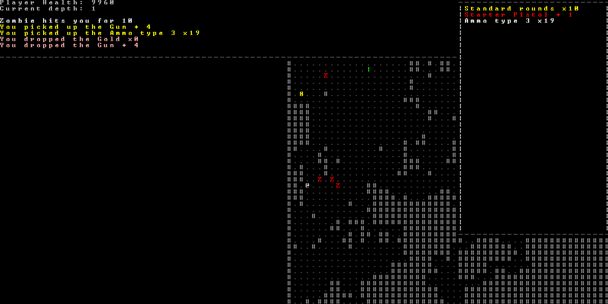

# JavaRoguelike
Attempt to develop a roguelike in Java with AsciiPanel library

Fully functional roguelike game featuring procedurally generated levels, 4-directional movement, AI pathfinding, progression system, menu screens, inventory system and 2D ray-tracing for projectiles.

Releases : https://github.com/YonZhou/JavaRoguelike/releases
